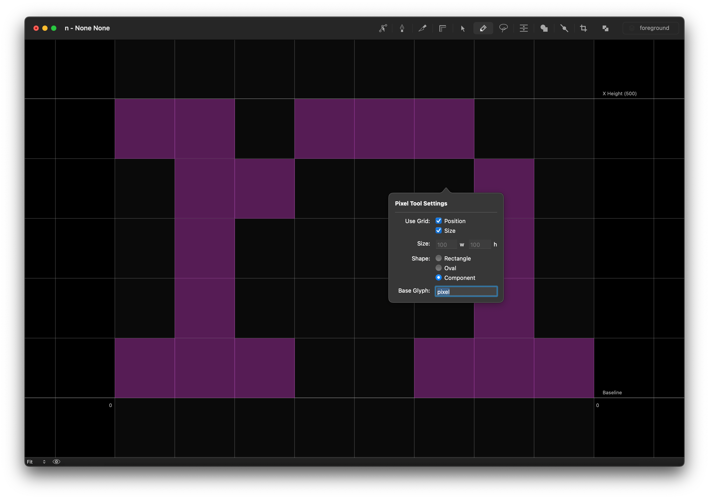

# Pixel Tool

An interactive tool to draw ‘pixels’ using rectangles, ovals or components.

## Installation

Download and double-click the `.roboFontExt` file to install manually, or get it via [Mechanic 2](http://robofontmechanic.com/).

When installed, Pixel Tool becomes available from the Glyph Editor’s toolbar.

## Usage

- Open the Glyph Editor
- Click on the Pixel Tool icon in the toolbar to activate it.

### Drawing Pixels
- Left-click on empty space in the Glyph Editor to add a pixel. 
- Click and drag to continue drawing pixels.
- Left-click on existing pixels to remove them.

### Settings

#### Use Grid: 

Pixel Tool has the ability to react to your native RoboFont preference setting for "Grid Size".

- **Position:** Activating this setting forces all new pixels to align their origin (bottom-left) to grid intersections.
- **Size:**  Activating this setting forces all new pixels to be sized like one cell in the grid.

#### Size: 

You can set your own pixel width and height manually here.

#### Shape: 

- **Rectangle**
- **Oval**
- **Component:** Pixel Tool will draw a component which references the **Base Glyph** name provided.